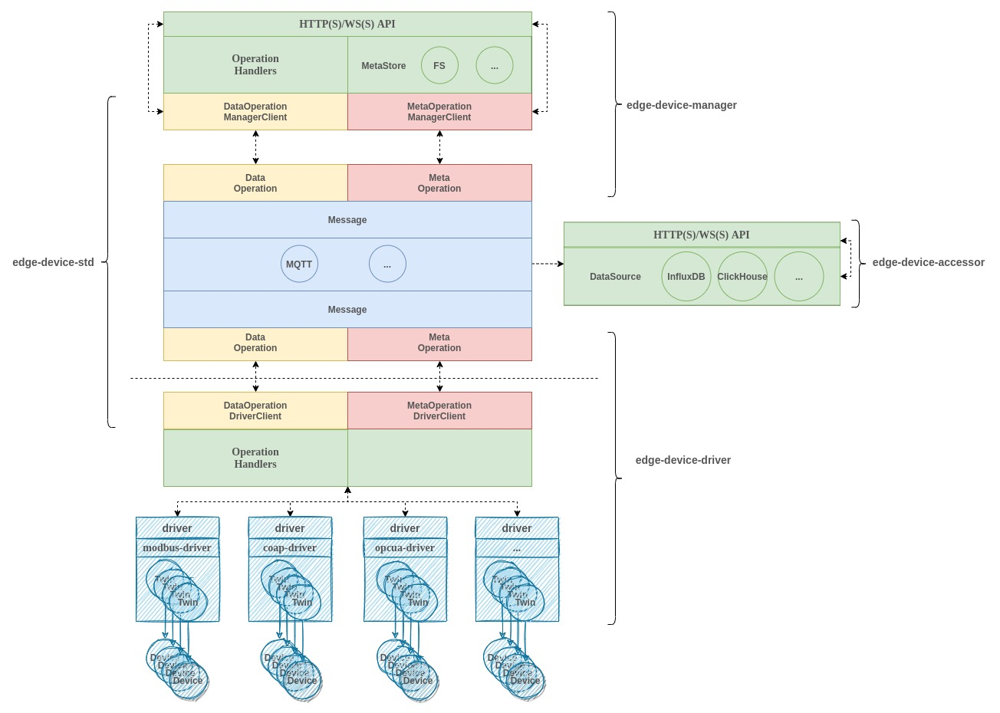

# 系统架构

## 系统组件

1. [edge-device-std](https://github.com/thingio/edge-device-std) 为系统其它组件提供基础服务：

    - `config` 提供配置支持，基于 [viper](https://github.com/spf13/viper) 实现读取配置文件的功能；
    - `version` 定义版本信息，版本信息可用来标识通信格式等；
    - `logger` 提供日志支持；
    - `models` 定义公共接口；
    - `msgbus` 封装了 MQ 的操作逻辑，向上层数据操作提供基础通信能力；
    - `operations` 基于底层 MessageBus 提供的基础通信能力封装了元数据操作和物模型操作，并分别为 `manager` 及 `driver` 提供了客户端实现；

2. [edge-device-driver](https://github.com/thingio/edge-device-driver) 提供设备驱动服务快速构建能力：

    - `interval/driver` 定义设备驱动服务；
    - `pkg/startup` 初始化并启动设备驱动服务；

3. [edge-device-manager](https://github.com/thingio/edge-device-manager) 提供设备管理服务快速构建能力：

    - `etc`：
        - `resources`:
            - `products`：产品元数据的默认存放路径；
            - `devices`：设备元数据的默认存放路径；
    - `pkg`：
        - `manager`： 定义设备管理服务；
        - `metastore` 定义元数据管理接口（提供基于本地文件系统的默认实现），用户可基于该接口指定其它元数据托管媒介；
        - `startup` 初始化并启动设备管理服务；

4. [edge-device-accessor](https://github.com/thingio/edge-device-accessor) 提供持久化和访问（已持久化）设备数据的能力；

5. [edge-randnum-driver](https://github.com/thingio/edge-randnum-driver) 设备驱动示例（生成随机数）：

    - `driver`：
        - `protocol.go` 定义驱动服务的设备协议元数据；
        - `driver.go` 实现 [DeviceTwin](../../../models/device_twin.go)
          接口，并提供设备影子构建方法 [DeviceTwinBuilder](../../../models/device_twin.go)；
    - `etc/config.yaml`：设备驱动服务配置文件的默认路径；
    - `main.go`：使用 `edge-device-driver` 的 `startup.Startup()` 初始化并启动驱动服务。